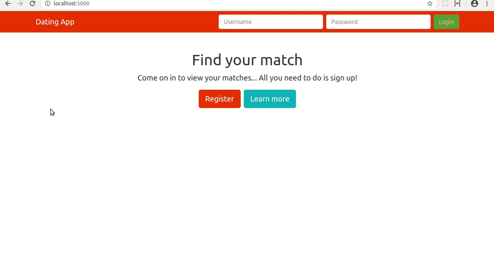

# DatingApp

Dating App. A web app for meeting and dating people.

## Demo

## Getting Started

These instructions will get you a copy of the project up and running on your local machine for development and testing purposes. See deployment for notes on how to deploy the project on a live system.

### Prerequisites

Operation System `Linux`, `Windows` or `macOS`. Make sure you have [.NET Core](https://dotnet.microsoft.com/download), [Node.js](https://nodejs.org) and [Angular CLI](https://cli.angular.io/) installed globally on your machine.

### Installing

Clone the project into your machine. Go to your terminal and cd into `DatingApp.API` directory. Run `dotnet run` for a dev server. Navigate to `http://localhost:5000/`.

### Building the project

Go to your terminal and cd into `DatingApp-SPA` directory. Run `ng build` to build the project. The build artifacts will be stored in the `wwwroot` directory inside `DatingApp.API`. Run `ng build --prod` for a production build.

## Deployment

The app can be published to a web server or a cloud server with minimum configuration.

## Built With

* [.NET Core](https://dotnet.microsoft.com/) - The back-end framework used
* [Angular](https://angular.io/) - The front-end framework used

## Acknowledgments

This project is based on the course [Build an app with ASP.NET Core and Angular from scratch](https://www.udemy.com/course/build-an-app-with-aspnet-core-and-angular-from-scratch/)
